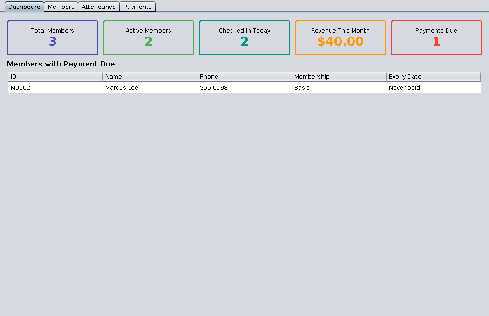
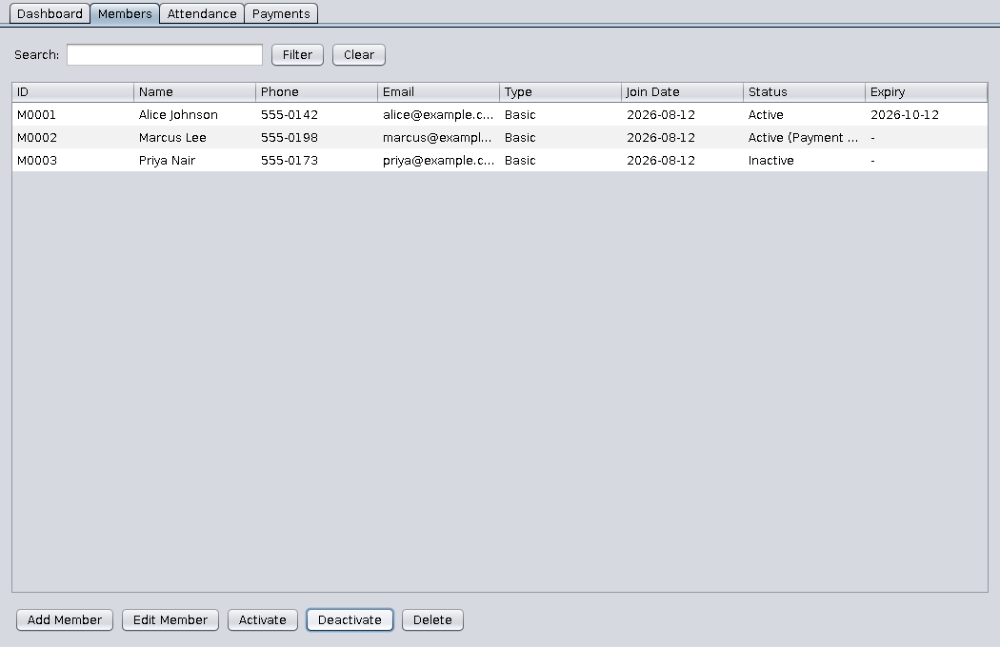
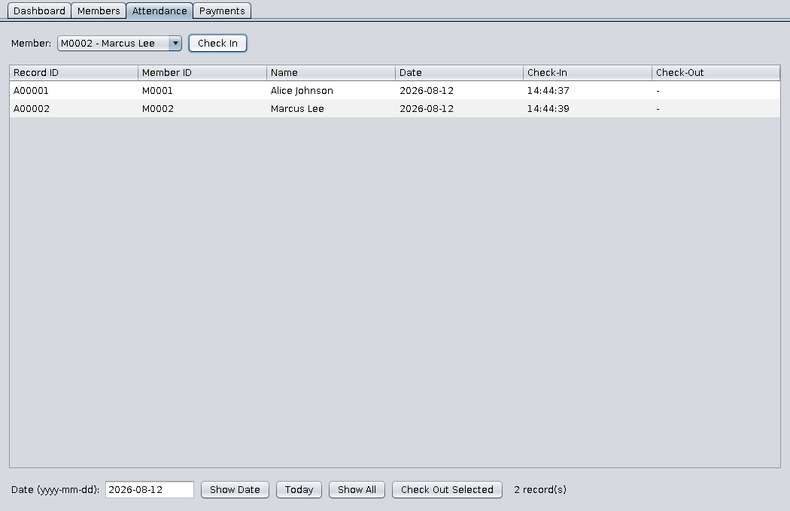
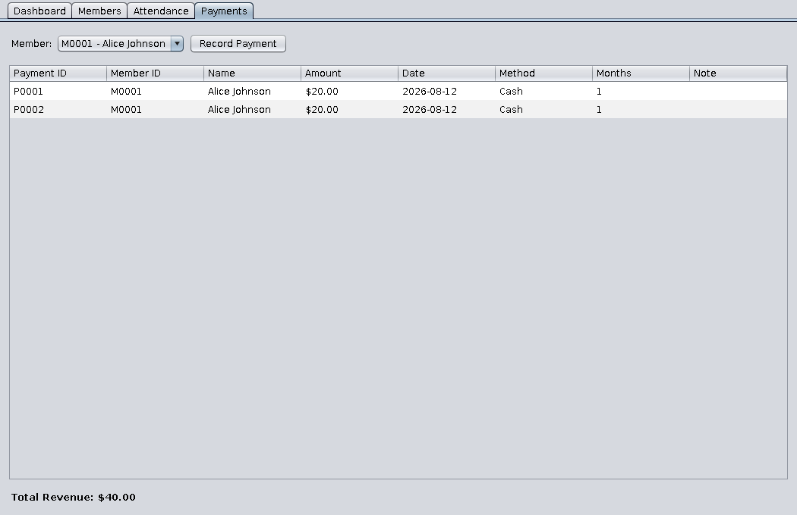

# Gym Management System

A desktop application for managing gym memberships, built with Java Swing.
Handles member registration, attendance tracking, membership activation/
deactivation, and payment management — with zero external dependencies.


## Screenshots

| Dashboard | Members |
|---|---|
|  |  |

| Attendance | Payments |
|---|---|
|  |  |

## Features

- **Member registration** — add members with name, phone, email, and
  membership tier (Basic / Standard / Premium), each with its own monthly
  rate. Edit details or delete a member later.
- **Activation / deactivation** — toggle a member's active status without
  deleting their history. Inactive members won't appear in the attendance
  check-in list.
- **Attendance tracking** — check members in/out from a dropdown of active
  members; view attendance by date or across all records; prevents
  duplicate open check-ins on the same day.
- **Payment management** — record payments (amount, date, method, months
  covered); each payment automatically extends the member's membership
  expiry date (stacking on top of any remaining time if renewed early).
  A dashboard tab surfaces members whose payment is due/overdue and total
  revenue for the current month.

## Requirements

- JDK 17 or later
- No external libraries — pure Java SE + Swing

## Getting Started

```bash
git clone https://github.com/<your-username>/gym-management.git
cd gym-management

# Compile
find src -name "*.java" > sources.txt
javac -d build/classes @sources.txt

# Run
java -cp build/classes com.gym.Main
```

On first run the app creates a `data/` folder next to wherever you launch it
from, containing three CSV files (`members.csv`, `payments.csv`,
`attendance.csv`). All changes save immediately — there's no separate "save"
step. This folder is gitignored so your local test data never gets committed.

### Optional: build a runnable jar

```bash
find src -name "*.java" > sources.txt
javac -d build/classes @sources.txt
cd build/classes
jar cfe ../../gym-management.jar com.gym.Main .
cd ../..
java -jar gym-management.jar
```

## Project Structure

```
src/main/java/com/gym/
├── Main.java                  entry point, sets Nimbus look & feel
├── model/
│   ├── Member.java
│   ├── Payment.java
│   ├── AttendanceRecord.java
│   ├── MembershipType.java    enum: BASIC / STANDARD / PREMIUM (+ rate)
│   └── PaymentMethod.java     enum: CASH / CARD / UPI / BANK_TRANSFER
├── storage/
│   └── DataStore.java         in-memory store + CSV persistence + business logic
├── ui/
│   ├── MainFrame.java         JTabbedPane host window
│   ├── DashboardPanel.java    stats cards + payment-due table
│   ├── MembersPanel.java      member table + add/edit/activate/delete
│   ├── MemberFormDialog.java  add/edit member modal
│   ├── AttendancePanel.java   check-in/out UI + attendance table
│   ├── PaymentsPanel.java     payment history + record-payment UI
│   └── PaymentFormDialog.java record-payment modal
└── util/
    └── CsvUtil.java           minimal quoted-CSV read/write helper
```

## Data Persistence

Storage is plain CSV rather than a database, so the project has zero external
dependencies and you can inspect/edit the data by hand if needed. If you'd
rather swap in SQLite or another database, `DataStore` is the only class
that would need to change — the UI talks to it through simple method calls
(`addMember`, `addPayment`, `checkIn`, etc.) and doesn't know about CSV at all.

## License

MIT — see [LICENSE](LICENSE).
